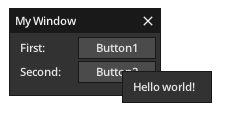
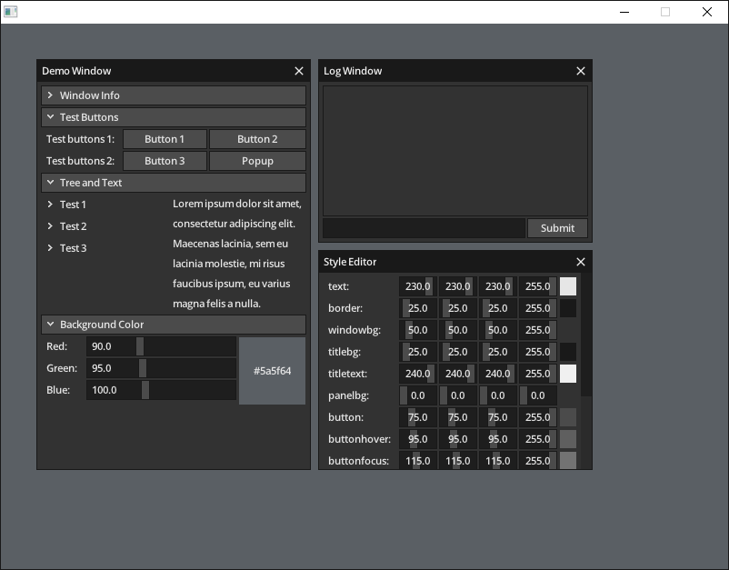

# nim-microui

A port of [microui](https://github.com/rxi/microui) for the Nim programming language.

Supports Nim versions v1.6.x, v2.0.x, v2.2.x.

## Example



```nim
if ctx.beginWindow("My Window", muRect(10, 10, 140, 86)):
  ctx.layoutRow([60'i32, -1], 0)

  ctx.Label("First:")
  if ctx.Button("Button1"):
    echo "Button1 pressed"

  ctx.Label("Second:")
  if ctx.Button("Button2"):
    ctx.openPopup(ctx.getId("My Popup"))

  if ctx.beginPopup(ctx.getId("My Popup")):
    ctx.Label("Hello world!")
    ctx.endPopup()

  ctx.endWindow()
```

## Demo


[`demo/microui_demo_sdl3.nim`](demo/microui_demo_sdl3.nim) is a microui demo using [nim-sdl3](https://github.com/transmutrix/nim-sdl3) for rendering.

Compile and run it as follows:

```
cd demo
nim c -r microui_demo_sdl3
```

Note that to run this demo [SDL3](https://libsdl.org/) needs to either be installed in your system, or a copy of the shared library available in your system's shared library search path.

## Usage
See [`doc/usage.md`](doc/usage.md) for usage instructions.
